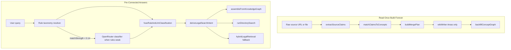

# UK legal knowledge search

Semantic legal search over curated UK legal-help content, with a **knowledge compiler** (pre-built wiki graph) for consumer guidance and hybrid chunk retrieval as fallback.

## Architecture



| Layer | Module | Purpose |
|-------|--------|---------|
| Concept graph | `lib/knowledge-compiler/concept-graph.ts` | Wiki pages as nodes; claims + edges in Postgres |
| Page index | `lib/knowledge-compiler/page-index.ts` | Resolve primary page + `pageMatchesIntent` guards |
| Graph assembly | `lib/knowledge-compiler/assemble-answer.ts` | Query-time answers from pre-built sections (no LLM) |
| Source integration | `lib/knowledge-compiler/integrate-source.ts` | Read once: extract → merge → write Areas/ wiki |
| Chunk fallback | `lib/legal-knowledge/retrieval.ts` | Hybrid lexical + vector when graph path unavailable |
| Directory | `lib/legal-search/run-directory-search.ts` | Lawyer/signpost search (unchanged) |
| Hybrid classification | `lib/legal-knowledge/classify-llm.ts` | OpenRouter JSON classifier when rules are weak |
| Intent fusion | `lib/legal-knowledge/classify-fusion.ts` | Merge rule + LLM taxonomy for graph retrieval |

## Database

Migrations:

- `prisma/migrations/20260628120000_legal_knowledge` — chunks + embeddings
- `prisma/migrations/20260712120000_knowledge_compiler` — concept graph tables

Tables: `knowledge_concepts`, `knowledge_claims`, `knowledge_edges`, `knowledge_contradictions`, `knowledge_integration_runs`

## Environment

```env
DATABASE_URL=postgresql://...
LLM_API_KEY=sk-or-...          # source integration + chunk fallback synthesis
LLM_BASE_URL=https://openrouter.ai/api/v1
KNOWLEDGE_GRAPH_MODE=primary   # primary | shadow | off
ENABLE_LLM_LEGAL_CLASSIFICATION=true   # hybrid OpenRouter classifier when rules are weak
LEGAL_CLASSIFY_LLM_THRESHOLD=0.14      # rule matchStrength below this triggers LLM
```

## Knowledge compiler commands

```bash
# Backfill concept graph from Areas/ wiki index
npm run knowledge:backfill-areas

# Integrate a new source into the wiki (Areas/ auto-write)
npm run knowledge:integrate -- --file=path/to/source.md
npm run knowledge:integrate -- --url=https://www.gov.uk/... --dry-run

# After integration or wiki edits, refresh the page index:
npm run index:wiki
```

## Search modes

| `answerMode` | Meaning |
|--------------|---------|
| `graph_assembly` | Pre-connected guidance from wiki concept cluster |
| `synthesis` | LLM citation-first answer from retrieved chunks (fallback) |
| `fallback` | Template excerpts when LLM unavailable |

## Eval

```bash
npm run legal-search:eval:unit        # intent + pageMatchesIntent
npm run legal-search:eval:retrieval   # graph page P@3
npm run legal-search:eval             # full integration
npm run legal-search:eval -- --tier=compiler
```

## Contradiction review

Pending conflicts: `GET /api/admin/search-quality?action=knowledge-contradictions`

Resolve: `POST /api/admin/search-quality` with `{ "action": "resolve-contradiction", "id": "...", "status": "resolved" }`

Contradictions block auto-merge during source integration; routine Areas/ updates proceed automatically.

## Classification learning

When rule-based taxonomy confidence is low, OpenRouter classifies the query. Disagreements and LLM-filled gaps are logged on each search.

Review gaps: `GET /api/admin/search-quality?action=classification-gaps`

Use `phraseCandidates` from logged rows to add new `userPhrases` / `subIssueRules` to `lib/legal/legal-issue-taxonomy-data.ts`.
