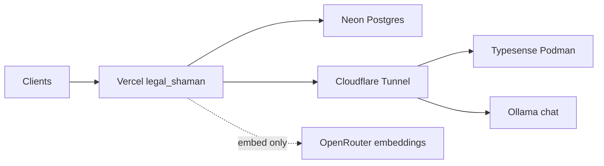

# Hybrid home hosting (Vercel + Fedora)

Keep **Vercel** for the public website and **Neon** for Postgres. Run **Typesense** and **Ollama** on your Fedora PC; expose them to Vercel via **Cloudflare Tunnel**.

Rollback: [partner-hosted-setup.md](./partner-hosted-setup.md).

## Hardware (this machine)

| Resource | Value |
|---|---|
| CPU | Intel i7-8550U, 8 threads |
| RAM | 31 GB |
| Disk | ~349 GB free on `/home` |

Use **7B quantized** models for Ollama. Do not run 32B models on this CPU.

## Target architecture



---

## Phase 1 — Typesense on Fedora

### 1a. Start Typesense

```bash
cd "/home/pravda/Projects/Legal Shaman/Signpost/infra/home"
export TYPESENSE_API_KEY="your-strong-key"   # set in shell only; also use in Vercel
./podman-typesense.sh
```

Or manually: see [restore-typesense.md](./restore-typesense.md). Bind to `127.0.0.1:8108` only.

### 1b. Cloudflare Tunnel (keep Vercel nameservers)

**You do not need to move `legalshaman.com` to Cloudflare nameservers.** Keep Vercel as DNS for the main site.

`search.legalshaman.com` on Vercel cannot point at a Cloudflare Tunnel — `cfargotunnel.com` is not publicly routable unless Cloudflare **proxies** the hostname in the same account (which requires Cloudflare DNS or a Business-plan partial setup).

**Recommended (Vercel NS unchanged):** quick tunnels — no custom subdomain on `legalshaman.com`:

```bash
cd Signpost/infra/home
./run-hybrid-tunnels.sh
# Copy the printed hostname into Vercel (no https:// for TYPESENSE_HOST):
./update-vercel-typesense.sh <hostname>.trycloudflare.com --quick
```

URLs change when `cloudflared` restarts; re-run the two commands above. Keep the PC and tunnel running.

**If Cloudflare dashboard asks to change nameservers:** click **Cancel** / do not complete zone setup for `legalshaman.com` unless you intend to move all DNS off Vercel.

**Optional stable hostnames without moving `legalshaman.com` NS:**

| Approach | NS change? |
|---|---|
| Quick tunnel (above) | No |
| Separate cheap domain on Cloudflare (e.g. `search.your-tunnel-domain.com`) | Only for that domain |
| Cloudflare partial CNAME setup on `legalshaman.com` | No — but requires **Business** plan |
| Full Cloudflare DNS for `legalshaman.com` | Yes — not recommended if you want Vercel DNS |

**Named tunnel** (`legal-shaman-home`) is only needed for a stable custom hostname on a Cloudflare-managed domain — not for quick tunnels.

**Ollama Host header:** Ollama rejects non-local `Host` headers (HTTP 403). The tunnel must target **`ollama-proxy.py`** on port **11435**, not Ollama directly on 11434.

### 1c. Re-index from Neon

```bash
export PATH="$HOME/.local/node/bin:$PATH"
cd "/home/pravda/Projects/Legal Shaman/Signpost/web"
# .env.local should have DATABASE_URL (Neon) and local Typesense:
# TYPESENSE_HOST=localhost TYPESENSE_PROTOCOL=http TYPESENSE_PORT=8108 TYPESENSE_API_KEY=...
npm run typesense:restore
npm run search:index:verify
```

Expect `sraTypesenseCount` ~25,000.

### 1d. Vercel env (`legal-shaman`)

| Variable | Value |
|---|---|
| `DIRECTORY_SEARCH_BACKEND` | `typesense` |
| `ENABLE_TYPESENSE` | `true` |
| `ENABLE_TYPESENSE_UNIFIED` | `true` |
| `TYPESENSE_HOST` | `search.legalshaman.com` |
| `TYPESENSE_PROTOCOL` | `https` |
| `TYPESENSE_PORT` | `443` |
| `TYPESENSE_API_KEY` | same as Podman |

Redeploy production.

### 1e. Verify

```bash
curl -s https://www.legalshaman.com/api/search/status | jq '.directorySearchBackend, .activeDirectoryEngine, .typesenseListingsReachable, .legalEntitiesDocumentCount'
```

Expect: `typesense`, `typesense_unified`, `true`, thousands of documents.

---

## Phase 2 — Reduce OpenRouter cost (directory search)

| Variable | Value |
|---|---|
| `ENABLE_LLM_SEARCH` | `false` |

Directory search uses rule-based query parsing ([`query-rules.ts`](../../lib/legal-search/query-rules.ts)). No code change. Redeploy.

Guidance still uses OpenRouter until Phase 3.

---

## Phase 3 — Ollama for guidance chat

### 3a. Install and pull model

```bash
# Install Ollama from https://ollama.com then:
ollama pull qwen2.5:7b-instruct-q4_K_M
sudo systemctl enable --now ollama
```

Tunnel `llm.legalshaman.com` → `http://127.0.0.1:11435` (via `ollama-proxy.py`, **not** port 11434). See `infra/home/ollama-proxy.py`.

**Security:** Ollama has no API key. Use Cloudflare Access service token or a reverse proxy with an API key before exposing publicly on a named tunnel.

### 3b. Split chat vs embeddings (Vercel)

`legal_chunks` use **vector(1536)**. Keep OpenRouter for embeddings until a full re-ingest with a new dimension.

| Variable | Value |
|---|---|
| `LLM_BASE_URL` | `https://llm.legalshaman.com/v1` |
| `LLM_API_KEY` | `ollama` |
| `LLM_MODEL` | `qwen2.5:7b-instruct-q4_K_M` |
| `EMBEDDING_BASE_URL` | `https://openrouter.ai/api/v1` |
| `EMBEDDING_API_KEY` | OpenRouter key |
| `EMBEDDING_MODEL` | `text-embedding-3-small` |
| `LLM_EMBED_DIM` | `1536` |

### 3c. Verify guidance

Sign in → search `tenant deposit not returned` → badge **AI synthesised**. CPU inference may take 15–40s on first request.

---

## Phase 4 — Model tuning and monitoring

| Goal | `LLM_MODEL` | Notes |
|---|---|---|
| Balanced (default) | `qwen2.5:7b-instruct-q4_K_M` | ~5 GB RAM; first CPU response ~20–40s |
| Faster / lighter | `llama3.2:3b` | Lower quality; `ollama pull llama3.2:3b` |
| Avoid | `qwen/qwen3-32b` | Too large for i7-8550U |

Change `LLM_MODEL` in Vercel → redeploy (or wait for next deployment). No code change.

### Monitoring commands

```bash
# LLM loaded models and RAM
ollama ps

# Typesense container CPU/RAM
podman stats signpost-typesense --no-stream

# System memory
free -h

# Tunnels running (quick or named)
pgrep -a cloudflared
pgrep -a ollama-proxy

# Restart full hybrid stack
cd Signpost/infra/home && ./run-hybrid-tunnels.sh
```

### Production verification (2026-07-03 rollout)

- `GET /api/search/status` → `directorySearchBackend: "typesense"`, `typesenseListingsReachable: true`, ~29k documents
- `ENABLE_LLM_SEARCH=false` — directory search uses rule-based parsing (no per-search OpenRouter chat)
- Guidance chat via home Ollama; embeddings via OpenRouter (`EMBEDDING_*`, 1536-dim unchanged)

### Uptime requirements

- Fedora PC on; `signpost-typesense` container + `cloudflared` + `ollama-proxy.py` running
- If using trycloudflare quick tunnels, update Vercel hostnames after restart or switch to named tunnel + `search.legalshaman.com` CNAME in Vercel DNS

## GitHub Actions

Update repository secrets when hybrid is live:

- `TYPESENSE_HOST` → `search.legalshaman.com`
- `TYPESENSE_PROTOCOL` → `https`
- `TYPESENSE_PORT` → `443`
- `TYPESENSE_API_KEY` → home Typesense key
