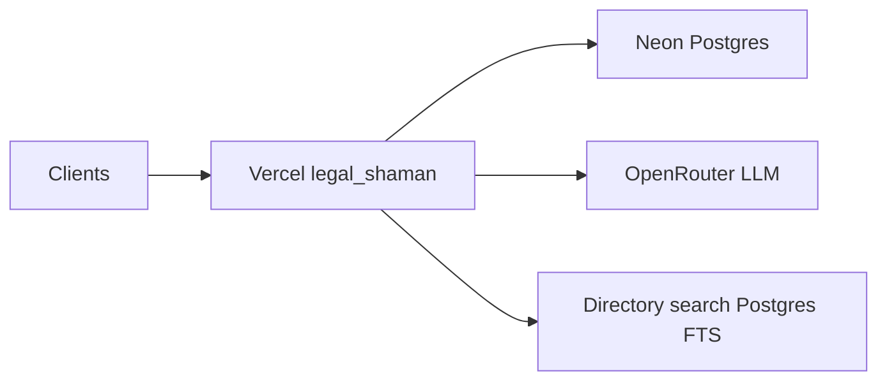

# Partner Hosted Set Up (rollback snapshot)

**Name:** Partner Hosted Set Up  
**Captured:** 2026-07-03  
**Purpose:** Document the production architecture **before** hybrid home hosting (Typesense + Ollama on Fedora). Use this to roll back Vercel env if hybrid changes cause issues.

No secrets are stored in this file. Values live in the Vercel dashboard (`legal-shaman` project) only.

## Architecture



| Component | Role |
|---|---|
| **Vercel** (`legal-shaman`) | Next.js app, API routes, `www.legalshaman.com` |
| **Neon Postgres** | Users, bookmarks, SRA register, `legal_chunks` (pgvector) |
| **OpenRouter** | Chat synthesis (guidance), query embeddings, directory LLM parse |
| **Directory search** | Postgres full-text on `sra_organisations` (not Typesense unified) |

Production defaults to Postgres for directory search because `VERCEL_ENV=production` sets `directorySearchBackend=postgres` unless `DIRECTORY_SEARCH_BACKEND` is overridden. See [`lib/legal-search/config.ts`](../../lib/legal-search/config.ts).

## LLM usage (Partner Hosted)

| Feature | OpenRouter calls |
|---|---|
| Directory search (`/api/search`) | 1 chat per search when `ENABLE_LLM_SEARCH=true` (default) |
| Guidance (`/api/legal-search`) | 1 embed + 1 chat per search |
| OSLAW live search | Planner + scorer (when enabled) |

## Vercel project

- **Project:** `saifk99-livecoms-projects/legal-shaman` (not the stale `web` project)
- **Domains:** `www.legalshaman.com`, `legalshaman.com`, `legalshaman.org`, `legalshaman.co.uk`

## Environment variables (names only — rollback values)

| Variable | Partner Hosted value |
|---|---|
| `DIRECTORY_SEARCH_BACKEND` | unset or `postgres` |
| `ENABLE_TYPESENSE` | `true` |
| `ENABLE_TYPESENSE_UNIFIED` | `true` (ineffective while backend=postgres) |
| `ENABLE_LLM_SEARCH` | `true` |
| `ENABLE_VECTOR_SEARCH` | `true` |
| `LLM_BASE_URL` | `https://openrouter.ai/api/v1` |
| `LLM_API_KEY` | OpenRouter key (Vercel encrypted) |
| `LLM_MODEL` | e.g. `qwen/qwen3-32b` |
| `LLM_EMBED_MODEL` | `text-embedding-3-small` |
| `LLM_EMBED_DIM` | `1536` |
| `TYPESENSE_HOST` | May point at terminated cloud cluster |
| `TYPESENSE_PROTOCOL` | `https` |
| `TYPESENSE_PORT` | `443` |
| `TYPESENSE_API_KEY` | Typesense Cloud key (if set) |
| `DATABASE_URL` | Neon (unchanged across rollouts) |
| `USER_SESSION_SECRET` | Session signing |
| `NEXT_PUBLIC_TURNSTILE_SITE_KEY` | Turnstile widget |
| `TURNSTILE_SECRET_KEY` | Turnstile verify |
| `ADMIN_SECRET` | Admin area |

## Verification baseline (2026-07-03)

`GET https://www.legalshaman.com/api/search/status` returned:

```json
{
  "directorySearchBackend": "postgres",
  "activeDirectoryEngine": "postgres",
  "enableTypesenseUnified": false,
  "typesenseListingsReachable": false,
  "legalEntitiesCollectionExists": false,
  "degradedModeWarnings": ["typesense_unreachable"],
  "sraPostgresCount": 25084,
  "lastIndexStatus": "failed",
  "lastIndexErrors": ["sra:sync: hostname: 'gxewjkzrbcavfp0dp-1.a2.typesense.net'"]
}
```

Sample checks:

- https://www.legalshaman.com/search?q=solicitor+london
- https://www.legalshaman.com/api/search/status

## Rollback procedure

1. Open [Vercel → legal-shaman → Environment Variables](https://vercel.com/saifk99-livecoms-projects/legal-shaman/settings/environment-variables).
2. Set or remove vars per table above (especially `DIRECTORY_SEARCH_BACKEND` → unset or `postgres`, `ENABLE_LLM_SEARCH` → `true`, `LLM_BASE_URL` → OpenRouter).
3. Remove hybrid-only vars: home tunnel hostnames for Typesense/Ollama if added.
4. **Redeploy** production (env changes need a new deployment for some flags; server-side LLM vars apply on cold start).
5. Verify `GET /api/search/status` → `activeDirectoryEngine: "postgres"`.
6. Confirm guidance still works (may use OpenRouter again).

## Related docs

- [restore-typesense.md](./restore-typesense.md) — Typesense Cloud history (terminated cluster)
- [hybrid-home-hosting.md](./hybrid-home-hosting.md) — Forward rollout to Fedora + tunnel
- [scheduled-refresh.md](./scheduled-refresh.md) — GitHub Actions index jobs
